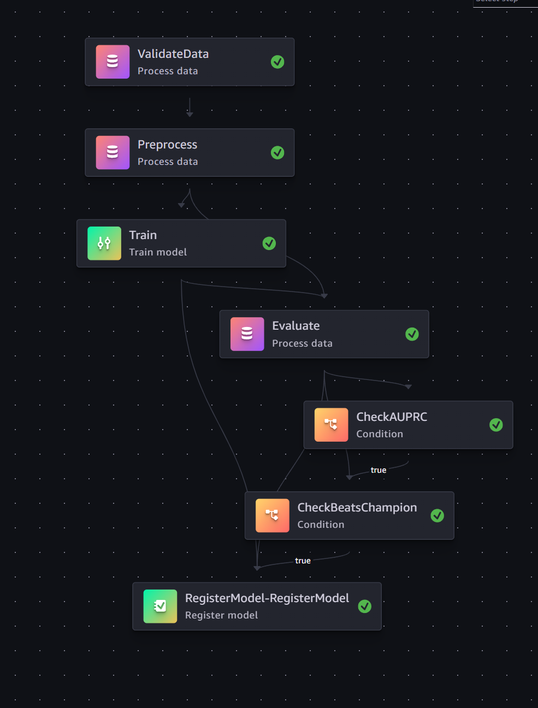

# Fraud Detection MLOps Pipeline (AWS SageMaker)

**SageMaker Pipelines → Quality Gate (AUPRC ≥ 0.80) → Model Registry → Real-time Endpoint → PSI Drift Alarm**

End-to-end MLOps pipeline for credit card fraud detection, built on the [MLOps Blueprint](https://github.com/Prisoe/MLOps_Template_Pipeline) template.

---

## Video
Youtube Link: https://youtu.be/z-RI2a5krig

## Dataset

[Kaggle: Credit Card Fraud Detection](https://www.kaggle.com/datasets/mlg-ulb/creditcardfraud)
- 284,807 transactions | 492 fraud (0.17%) — heavily imbalanced
- Features: V1–V28 (PCA-anonymised) + Amount + Time
- Target: `Class` (0 = legitimate, 1 = fraud)

Place `creditcard.csv` at `ml/creditcard.csv` before deploying.

---

## Architecture



```
Developer
  │
  │ 1) deploy.ps1
  ▼
CDK Stack (infra/)
  - S3 Artifacts Bucket (encrypted, versioned)
  - IAM SageMaker Execution Role
  - SNS Topic (email subscription)
  - EventBridge Rules → Lambda Alerts Formatter
  │
  │ 2) build_pipeline.py + run_pipeline.py
  ▼
SageMaker Pipeline: fraud-detection-pipeline
  ┌─────────────────────────────────────────────────────┐
  │ Preprocess (ProcessingStep)                         │
  │   - Drop 'Time', RobustScale 'Amount'               │
  │   - Stratified 70/15/15 split                       │
  │   - Write baseline.csv for drift monitoring         │
  ├─────────────────────────────────────────────────────┤
  │ Train (TrainingStep)                                │
  │   - XGBoost with scale_pos_weight ≈ 578             │
  │   - Handles 99.83% / 0.17% class imbalance          │
  │   - Primary metric: AUPRC (avg_precision)           │
  ├─────────────────────────────────────────────────────┤
  │ Evaluate (ProcessingStep)                           │
  │   - AUPRC, ROC-AUC, F1, confusion matrix            │
  │   - Writes evaluation.json to S3                    │
  ├─────────────────────────────────────────────────────┤
  │ CheckAUPRC (ConditionStep) ← QUALITY GATE           │
  │   - avg_precision >= 0.80 → RegisterModel           │
  │   - else → pipeline stops, no registration          │
  └─────────────────────────────────────────────────────┘
  │
  ▼
Model Registry (fraud-detection-model-group)
  - PendingManualApproval → you approve
  │
  │ 3) deploy-endpoint.ps1
  ▼
SageMaker Endpoint: fraud-detection-endpoint
  - Real-time inference
  - DataCapture enabled (100% → S3)
  - Returns: {"predictions": [0,1], "probabilities": [0.02, 0.98]}
  │
  │ 4) monitor.ps1
  ▼
Drift Monitoring
  - PSI per feature (V1–V28 + Amount)
  - CloudWatch Alarm: OverallPSI_Max ≥ 0.25 → SNS email
```

---

## Why XGBoost over Random Forest?

| Concern | Random Forest | XGBoost (chosen) |
|---|---|---|
| Class imbalance | Needs manual weighting | Native `scale_pos_weight` |
| Speed on 284k rows | Slower | `tree_method=hist` is fast |
| Primary metric | macro F1 | AUPRC (correct for imbalance) |
| Inference latency | Comparable | Slightly faster |

---

## Why AUPRC instead of F1 as quality gate?

With 0.17% fraud rate, a model predicting "all legitimate" gets **99.83% accuracy and F1 ≈ 0.999** on the majority class. AUPRC measures the tradeoff between precision and recall *only for the fraud class*, across all thresholds. Random baseline AUPRC ≈ 0.002. A score of **0.80** means the model genuinely distinguishes fraud.

---

## Quick Start

### Prerequisites
- AWS CLI configured (`aws sts get-caller-identity`)
- Python 3.10+, Node.js (for CDK)
- `creditcard.csv` downloaded from Kaggle → place at `ml/creditcard.csv`

### Setup
```powershell
python -m venv .venv
.\.venv\Scripts\Activate.ps1
pip install -r requirements.txt
```

### 1. Deploy everything
```powershell
.\scripts\deploy.ps1 -Region us-east-1 -EmailForAlerts "you@example.com" -AlertsMode all
```

### 2. Monitor pipeline (SageMaker Studio → Pipelines → fraud-detection-pipeline)

### 3. List model packages
```powershell
aws sagemaker list-model-packages `
  --model-package-group-name fraud-detection-model-group `
  --sort-by CreationTime --sort-order Descending `
  --region us-east-1
```

### 4. Approve a model
```powershell
python src/registry/approve_model.py --action approve `
  --arn "arn:aws:sagemaker:us-east-1:<ACCOUNT>:model-package/fraud-detection-model-group/1"
```

Or list + check metrics first:
```powershell
python src/registry/approve_model.py --action list
python src/registry/approve_model.py --action metrics --arn <ARN>
```

### 5. Deploy endpoint
```powershell
.\scripts\deploy-endpoint.ps1 -Region us-east-1 -Wait
```

### 6. Invoke endpoint
```powershell
# JSON payload: V1..V28 + Amount (28+1 = 29 features, Time already dropped)
$payload = '{"instances": [[-1.36, -0.07, 2.54, 1.38, -0.34, 0.46, 0.24, 0.10, 0.36, 0.09, -0.55, -0.62, -0.99, -0.31, 1.47, -0.47, 0.21, 0.02, 0.40, 0.25, -0.02, 0.28, -0.11, 0.07, 0.13, -0.19, 0.13, -0.02, 0.35]]}'
$payload | Out-File -Encoding ascii payload.json

aws sagemaker-runtime invoke-endpoint `
  --endpoint-name fraud-detection-endpoint `
  --content-type "application/json" `
  --accept "application/json" `
  --body fileb://payload.json `
  out.json --region us-east-1

Get-Content out.json
# {"predictions": [0], "probabilities": [0.031]}
```

### 7. Run drift monitoring
```powershell
.\scripts\monitor.ps1 -Region us-east-1 -Threshold 0.25
```

---

## Repo Structure

```
fraud-detection-mlops/
├── infra/                       # CDK: S3, IAM, SNS, EventBridge, Lambda
│   ├── lib/mlops-stack.ts
│   └── lambda/
│       ├── alerts_formatter/    # Formats EventBridge events → SNS emails
│       └── trigger-pipeline/    # Optional: scheduled pipeline execution
├── ml/
│   └── creditcard.csv           # ← place dataset here (not committed)
├── src/
│   ├── preprocess/preprocess.py # Drop Time, scale Amount, stratified split
│   ├── train/train.py           # XGBoost + scale_pos_weight
│   ├── evaluate/evaluate.py     # AUPRC, ROC-AUC, confusion matrix
│   ├── pipelines/
│   │   ├── build_pipeline.py    # Pipeline DAG definition
│   │   └── run_pipeline.py      # Trigger execution
│   ├── deploy/
│   │   ├── deploy_endpoint.py   # Real-time endpoint deployment
│   │   └── approve_model_package.py
│   ├── registry/approve_model.py
│   └── monitoring/
│       ├── model_monitor_setup.py  # PSI drift check
│       └── alarms.py               # CloudWatch alarm provisioning
├── scripts/
│   ├── deploy.ps1               # One-command full deploy
│   ├── deploy-endpoint.ps1
│   └── monitor.ps1
└── requirements.txt
```

---

## Metrics to Expect

Expected results on the Kaggle creditcard.csv dataset with this config:

| Metric | Expected |
|---|---|
| AUPRC (test) | 0.85 – 0.90 |
| ROC-AUC (test) | 0.97 – 0.98 |
| Recall (fraud) | ~0.85 |
| Precision (fraud) | ~0.85 |
| False positives | < 30 per 10k transactions |

